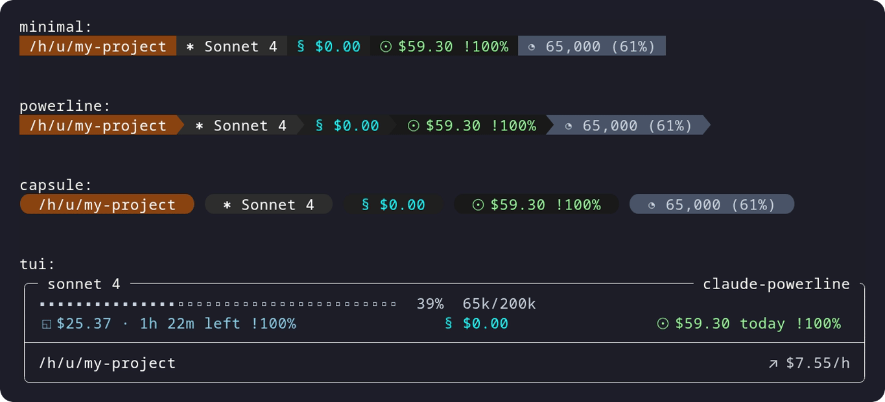
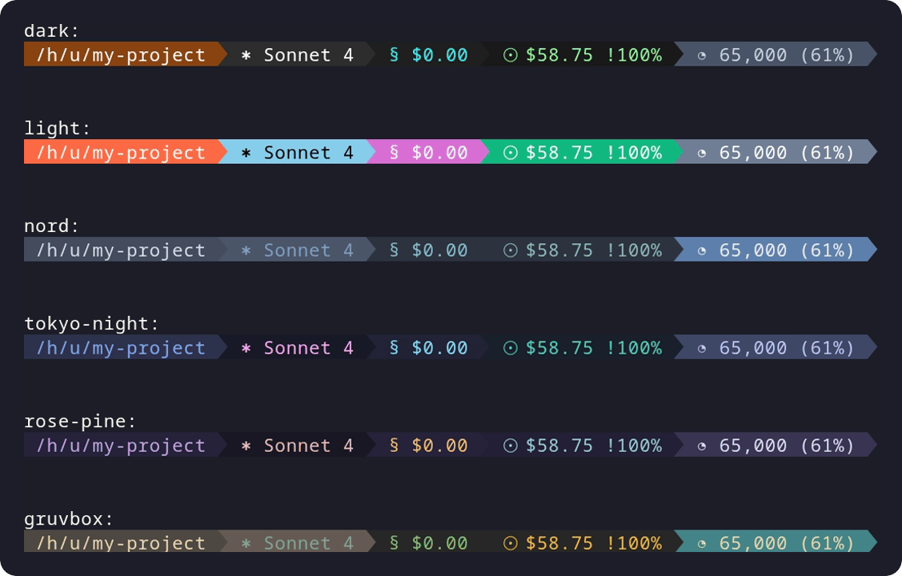

<div align="center">

# CCCandybar

**Powerline statusline for Claude Code — daemon-backed, config-driven, zero-config-file required.**


[](https://www.npmjs.com/package/@promptctl/cc-candybar)
[](https://www.npmjs.com/package/@promptctl/cc-candybar)


</div>

## What it is

CCCandybar is a statusline renderer for [Claude Code](https://docs.anthropic.com/en/docs/claude-code). It shows session cost, context usage, git status, model info, rate-limit utilization, and more — styled as a powerline, capsule, minimal, or full TUI panel.

A background daemon caches git state, usage data, and per-session values across concurrent Claude Code sessions. The renderer connects to the daemon over a Unix socket, so every invocation is fast (~50ms budget) and stateful.

Fork of [@owloops/claude-powerline](https://github.com/Owloops/claude-powerline), evolved with CLI override flags so the entire config lives in `settings.json` — no separate config file needed.

## Quick start (macOS)

```bash
pnpm dlx @promptctl/cc-candybar@latest install
```

That single command:

1. Builds `~/Applications/CCCandybarURLHandler.app` and registers the `cc-candybar://` URL scheme with macOS Launch Services.
2. Copies the runtime into `~/Library/Application Support/CCCandybar/url-handler.mjs` (stable path independent of pnpm cache).
3. Writes the statusline renderer command into `~/.claude/settings.json`.

Restart Claude Code. The statusline appears, and cmd-clicking the sessionId copies the full id to your clipboard.

## CLI flags

All flags go directly in the `settings.json` command — no config file required.

| Flag | Purpose | Example |
|------|---------|---------|
| `--theme` | `dark`, `light`, `nord`, `tokyo-night`, `rose-pine`, `gruvbox`, `custom` | `--theme=nord` |
| `--style` | `minimal`, `powerline`, `capsule`, `tui` | `--style=capsule` |
| `--charset` | `unicode` (default), `text` | `--charset=text` |
| `--config` | Custom config file path | `--config=~/.candybar.json` |
| `--layout` | Define lines and segment ordering inline | `--layout "directory git \| model session"` |
| `--show` | Enable multiple `show*` booleans on a segment | `--show git=workingTree,upstream` |
| `--display` | Set multiple `display.*` fields | `--display autoWrap=false,padding=1` |
| `--segment` | Set multiple segment fields | `--segment block.type=weighted` |
| `--set` | Universal escape hatch for any dotted config path | `--set color.git=#3a3a3a/#d0d0d0` |

Override priority: CLI flags > environment variables > config files > defaults.

```bash
pnpm dlx @promptctl/cc-candybar@latest install \
  --style=capsule \
  --layout 'directory model session' \
  --show git=workingTree
```

## Architecture

```
┌─────────────┐   Unix socket   ┌──────────────────┐
│ Claude Code │ ──────────────► │ cc-candybar daemon│
│  (hook)     │   render req    │                  │
│             │ ◄────────────── │  git cache       │
└─────────────┘   ANSI output   │  usage cache     │
                                │  session state   │
                                │  render cache    │
                                └──────────────────┘
```

- **Daemon** (`src/daemon/`) — long-lived background process. One per user. Caches git state via filesystem watchers, usage data, and per-session key/value state. Idles out after 30 minutes of inactivity.
- **Client** (`src/daemon/client.ts`) — each Claude Code hook invocation connects to the daemon, sends a render request, and prints the ANSI response. On failure, spawns a fresh daemon and emits empty output.
- **Renderer** (`src/render/`, `src/segments/`) — segments produce styled output from cached data. Themes cascade from defaults through palette resolution using OKLCH color math.
- **TUI grid** (`src/tui/`) — CSS Grid-inspired layout engine with breakpoints, column sizing (`auto`, `1fr`, fixed), spanning, and automatic culling of empty segments.

## Segments

| Segment | Shows | Symbol |
|---------|-------|--------|
| directory | CWD name (`full`, `fish`, `basename`) | — |
| git | Branch, SHA, working tree, upstream, stash, tags | `⎇` |
| model | Current Claude model | `✱` |
| session | Per-session cost/tokens/breakdown | `§` |
| today | Daily usage with budget monitoring | `☉` |
| context | Context window usage with auto-compact threshold | `◔` |
| block | 5-hour rate-limit utilization | `◱` |
| weekly | 7-day rolling rate-limit utilization | `◑` |
| metrics | Response time, duration, lines changed | `⧖` |
| version | Claude Code version | `◈` |
| tmux | tmux session name | — |
| sessionId | Session identifier (cmd-click to copy) | `⌗` |
| env | Arbitrary environment variable | `⚙` |

Each segment supports multiple display styles (text, bar, blocks, dots, capped, geometric, etc.) and configurable budget thresholds with visual warnings.

## Themes

6 built-in themes: `dark`, `light`, `nord`, `tokyo-night`, `rose-pine`, `gruvbox`. Or create a custom theme with per-segment `bg`/`fg` colors:

```json
{
  "theme": "custom",
  "colors": {
    "custom": {
      "directory": { "bg": "#ff6600", "fg": "#ffffff" },
      "git": { "bg": "#0066cc", "fg": "#ffffff" }
    }
  }
}
```

## TUI panel mode

Full CSS Grid-inspired layout with responsive breakpoints, column spanning, per-cell alignment, and custom box characters. See the old README's TUI section for the complete grid config reference.

<details>
<summary><strong>Styles</strong></summary>



</details>

<details>
<summary><strong>Themes</strong></summary>



</details>

## Installation

Requires Node.js 18+, Claude Code, and Git 2.0+. For best display, install a [Nerd Font](https://www.nerdfonts.com/) or use `--charset=text` for ASCII-only symbols.

### Manual setup

Edit `~/.claude/settings.json` directly. Pin the version — don't use `@latest` (pnpm caches aggressively and won't pick up new releases).

```json
{
  "statusLine": {
    "type": "command",
    "command": "pnpm dlx @promptctl/cc-candybar@0.2.3 --style=powerline"
  }
}
```

### Config files

If you prefer a standalone config file, CCCandybar reads (in priority order):

- `./.claude-powerline.json` — project-specific
- `~/.claude/claude-powerline.json` — user config
- `~/.config/claude-powerline/config.json` — XDG standard

Config files hot-reload — no restart needed.

## What changed from claude-powerline

CCCandybar is a fork of `@owloops/claude-powerline` with these additions:

- **Daemon architecture** — background process with git filesystem watchers, usage cache, and per-session state shared across concurrent sessions.
- **CLI override flags** — `--layout`, `--show`, `--display`, `--segment`, `--set` let you configure everything inline in `settings.json` without a separate config file.
- **Session state store** — generic key/value per-session state, replacing separate theme/toolbar state types.
- **OKLCH color math** — theme colors resolve through OKLCH for perceptual uniformity.

## Contributing

Contributions welcome. See [CONTRIBUTORS.md](CONTRIBUTORS.md) for people who have contributed outside of GitHub PRs.

## License

[MIT](LICENSE)
